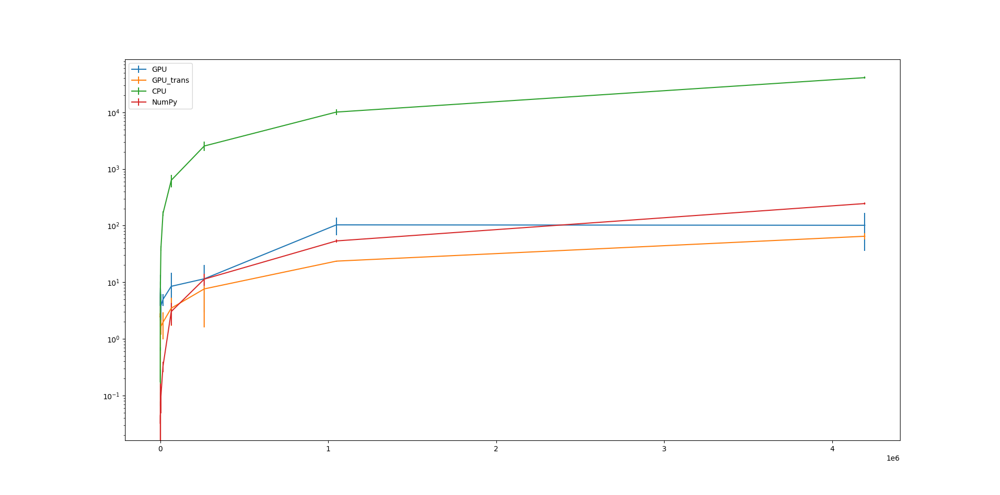

# cuda_FFT
example cuda FFT implementation

Just run main.py. You will need to install some libraries to do so.
Important libraries to install is
1. numpy
2. numba

other libraries are not important but used for plotting graph I show below.
If you don't need those stuffs just import functions from FFT.py and FFT_transpose.py into your script.

# Performance

# Note
Maybe I will try to implement this on c++ later.
